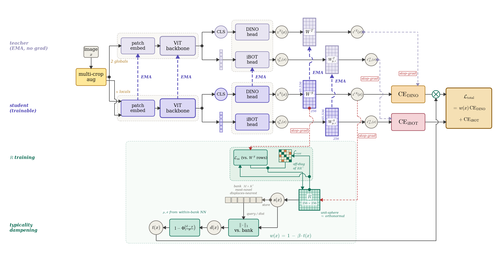

# Pathology Foundation Model Training — Methodological Extensions to DINOv2

This repository trains Vision Transformer foundation models on whole-slide pathology tiles via self-supervised learning. It starts from the DINOv2 training recipe (Meta AI, 2023) — a joint DINO CLS-token objective + iBOT masked-patch objective + KoLeo regularizer on a student/EMA-teacher pair — and extends it in four directions that target pathology-specific failure modes of the vanilla recipe: semantic masking in iBOT, an auxiliary patch-prototype clustering loss, adaptive per-sample gradient dampening on morphologically redundant tiles ("typicality dampening" / "batch concurrence"), and three optional augmentation modes that produce additional student views from frozen segmentation models.

Every extension is opt-in through a command-line flag defaulting to `False`. With every flag off, the code reduces to a clean DINOv2 implementation with the minor alignments noted at the bottom of this document.

---

## 1. Semantic iBOT — `--use_semantic_ibot`

Vanilla iBOT masks tokens by a Bernoulli draw or by rectangular block, so the positions the student has to reconstruct are spatially arbitrary. On H&E pathology tiles, most of the image is either stroma, fat, or empty background — unsupervised masks drawn uniformly land on semantically uninformative regions the majority of the time, and the iBOT signal degrades to "reconstruct the texture of lymphocyte-free whitespace."

This repository replaces the random mask with a **semantic mask** produced by a frozen ADIOS- or ViT-UNet-based mask model (`models.vision_transformer.auxiliary_models.ADIOSMaskModel`, `MaskModel`). The frozen model was pretrained separately (ADIOS / adversarial inpainting) and outputs a `[B, num_masks, H, W]` soft segmentation: per-sample probability maps over `num_masks` semantic classes (e.g. nuclei, stroma, glands, etc. — depending on how the mask model was trained).

At each training step:

1. The first teacher global crop is forwarded through the frozen mask model (no grad, bfloat16), yielding soft masks.
2. `training.helpers.convert_semantic_masks_to_token_masks` avg-pools the soft masks to patch resolution and thresholds to produce `[B, num_masks, N]` binary token masks plus per-mask weights (1 / num-masked so every mask channel contributes equally regardless of how many tokens it selects).
3. A subset of `num_masks` channels is sampled per iteration (`--semantic_masks_per_iteration`, typically 1 — randomly chosen every step) to limit compute.
4. The student backbone is called again on the same global crop with each selected semantic mask, and the iBOT loss is computed on the masked patch tokens against the teacher's unmasked targets. The result is added to the total loss with weight `--semantic_ibot_weight`.
5. When `--use_semantic_prototypes` is also true, one of the already-computed semantic backbone outputs is routed into the patch prototype clustering loss (§2) so that clustering also receives semantically-gated supervision.

The iBOT loss in this codebase uses a **gather-then-project** path (`_gather_and_compute_weights` + `iBOTPatchLoss.forward_gathered`) that collects only the masked tokens before projection through the `patchhead`, avoiding the full `[B, N, 65536]` activation that naive implementations materialize.

## 2. Patch Prototype Clustering — `--use_prototype_clustering`

On top of DINO/iBOT, the student patch tokens are clustered against a learnable soft-prototype bank (`models.prototype_bank.LinearPrototypeBank`, `--num_prototypes` prototypes). `losses.prototype_loss.PatchPrototypeLoss` emits three terms:

- **Clustering loss** — cross-entropy of student patch-prototype assignments against the teacher's Sinkhorn-Knopp-normalized assignments (temperatures: `--clustering_teacher_temp`, `--clustering_student_temp`).
- **Teacher-prototype arrangement loss** — a weight-norm regularizer on the prototype vectors themselves.
- **KoLeo on prototypes** — repulsive regularization over the prototype bank, driving it to spread out uniformly on the sphere.

The prototype bank is its own `DistributedDataParallel` module with its own `AdamW` optimizer (`optimizer_prototypes`), stepped independently from the student optimizer — which lets the prototypes train at a different LR and weight decay from the backbone. Default in `run_with_submitit.py`: `use_prototype_clustering = False`, but `num_prototypes = 16384` when turned on.

## 3. Typicality Dampening / Batch Concurrence — `--use_typicality_dampening`

*Schematic above:* end-to-end view of how the typicality module sits next to a standalone DINOv2 + iBOT student/teacher pair (vector originals at [`figures/typicality_dampening.svg`](figures/typicality_dampening.svg) / [`.pdf`](figures/typicality_dampening.pdf); source: [`figures/generate_typicality_dampening.py`](figures/generate_typicality_dampening.py)). The top two lanes are the standard DINOv2 EMA-teacher / trainable-student arms, fully drawn out (patch embed → ViT backbone → CLS / patches → DINO and iBOT heads → projector `W^{S/T}` → projected `z'`). The pink "semantic iBOT" lane on the left shows the frozen mask model fan-out: the first global crop drives the model, all `num_masks=3` soft channels are used per step (no sampling), and these 3 semantic masks `M_sem` together with the always-on random block mask `M_block` are inserted as `[MASK]` tokens at the student PE→backbone wire — producing 3 sem-masked patch-token columns feeding `CE_iBOT^{sem}` alongside 1 block-masked column feeding the standard `CE_iBOT^{block}`. The green "typicality dampening" lane at the bottom taps the student's projected CLS state `z'^S(x)` (stop-grad, dashed red), feeds the representative-prototype matrix `R` (256×256, unit-sphere ≈ orthonormal), produces the typicality signature `s(x)`, queries the bank by `‖·‖₁`, computes `d(x)`, normalizes via `1−Φ((d−μ)/σ)` to get `t(x)`, and runs a return bus along the figure floor carrying `w(x) = 1 − β · t(x)` up to the `⊗` node that multiplicatively gates `CE_DINO` (and only `CE_DINO` — `iBOT^{block}` and `iBOT^{sem}` are not modulated). The R-training sub-island on the same green lane shows `L_nn` (vs. `W^S` rows; dashed-red stop-grad arrow drops in from the student's `W^S`) and `L_cov` (Gram-glyph showing penalized off-diagonals of `RR^⊤`) merging into `L_repr`, which loops back up to update `R`. Total loss in the right-hand mix box is `L_total = w(x) · CE_DINO + CE_iBOT^{block} + λ_sem · CE_iBOT^{sem}`. Purple dashed EMA arrows tie every paired student↔teacher submodule (patch embed, ViT backbone, heads, `W^S → W^T`, `W^S_{p,i} → W^T_{p,i}`).

*Motivation.* Pathology datasets are long-tailed. At ViT-L scale a training batch can be dominated by morphologically similar tiles (several thousand slices of stroma/fat/epithelium look interchangeable at the embedding level). Under the standard DINO temperature, these common tiles contribute as much per-sample gradient as rare ones, so the rare signal is drowned; but they are also highly redundant, so the gradient they contribute is largely wasted.

*Mechanism* (`typicality/`, three small modules):

- **`RepresentativePrototypes`** (`typicality.representative_prototypes`) holds `K'` unit-norm anchors on the sphere of the student's 256-dim DINO-head bottleneck (before the final `out_dim`-wide prototype layer). Each step, a representative-prototype loss `L = L_nn + L_cov` pushes every anchor toward its nearest DINO prototype (`L_nn`) and spreads the anchors out (`L_cov`); the anchors are re-normalized to the sphere after each step. They are optimized by a dedicated `R_optimizer` (AdamW, `--typicality_repr_lr`, weight decay 0).
- **`TypicalityBank`** keeps a running reservoir of `--typicality_bank_size` softmax signatures — one signature per sample, each of length `K'` — computed from the student's bottleneck representation of the first global crop against the anchors. The bank refreshes a fraction (`--typicality_replace_fraction`) of its entries each step.
- **`TypicalityScorer`** compares each new signature's L1-distance to the bank's current mean/std distance distribution, squashes that into a per-sample typicality `t ∈ [0, 1]` (1 = very typical, 0 = very rare), and exposes two modulations of the DINO CLS loss:
  - `adaptive_temp` — per-sample student temperature τ_i = τ_base × (1 + α × t_i). Typical samples get a higher τ, producing flatter student distributions and therefore smaller gradients.
  - `weighted_loss` — per-sample loss weights w_i = 1 − β × t_i. Typical samples are weighted down directly.

`DINOLoss.forward` accepts both `sample_temperatures` and `sample_weights` kwargs; whichever is non-`None` is applied. A `--typicality_warmup_iters`-step warmup lets the bank fill before any modulation kicks in.

The feature adds three pieces of state (`RepresentativePrototypes`, `R_optimizer`, `TypicalityBank`) to the checkpoint, gated by the flag so disabled runs still produce lean checkpoints.

## 4. Augmentation Extensions

Three optional augmentation modes each append extra student views to the DINO CLS forward pass (and, where noted, to the KoLeo regularizer). They are independent — any combination of the three can be enabled. Each creates its crops from the *first* teacher global crop via a frozen upstream model or random masks, and `training.helpers.calculate_total_student_views` accounts for the expanded view count when constructing `DINOLoss`.

### 4a. Adversarial-mask-as-student-view — `--use_adversarial_mask_augmentation`

This re-uses the same frozen mask model as semantic iBOT (§1) — `--mask_checkpoint`, `--mask_model_arch`, `--num_masks`. The difference is the **scope of consumption**: semantic iBOT uses the model's output as *token-level* masks inside the iBOT loss; this feature uses the same model's output as *image-level* masks to create additional student views. Soft masks from the frozen model are element-wise multiplied onto the global crop (`training.helpers.apply_masks_to_images`), producing `num_masks` masked global views that the student sees as additional crops; `--crops_per_mask` local crops are optionally extracted from each. These masked globals also enter the KoLeo regularizer (matching the morphological_rarity reference behavior).

Both features can be enabled simultaneously — the mask model is loaded once and shared.

### 4b. CellViT augmentation — `--use_cellvit_augmentation`

A frozen CellViT model (`--cellvit_checkpoint`) produces a 2-channel nuclei/background segmentation of the first global crop. The student then sees two masked global views (nuclei-only, background-only) plus `--cellvit_crops_per_channel` random local crops extracted from each. The CellViT architecture (`models.vision_transformer.auxiliary_models.CellViT`) is a ViT encoder with a convolutional U-Net-style decoder using `Conv2DBlockBN` / `Deconv2DBlockBN` blocks, loaded in bfloat16 and frozen. The helpers live in `training.helpers`: `load_pretrained_cellvit_model`, `apply_cellvit_masks`, `extract_crops_from_cellvit_channel`.

### 4c. Random rectangular mask augmentation — `--use_random_mask_augmentation`

For ablation and reproducibility of prior experiments. `training.helpers.generate_random_image_masks` emits `--random_num_masks` independent rectangular masks of random position and size per image; these are multiplied onto the first global crop to produce additional masked global student views, with `--random_crops_per_mask` locals extracted from each. No learned model involved.

---

## 5. Pathology FM Recipe — `--use_pathology_recipe`

*Motivation.* Independent of the four feature toggles above, this branch bundles a set of training-recipe changes that the open pathology-FM literature has converged on between 2024 and 2026. They are individually small but jointly change training behavior enough that mixing them with the `consolidated` defaults would produce a config that is neither the old recipe nor the new one. A single `--use_pathology_recipe` flag pulls the whole bundle in; leaving it `False` preserves the `consolidated` behavior bit-for-bit. Primary references: Virchow (arXiv:2309.07778), Virchow2 / Virchow2G (arXiv:2408.00738), Midnight (MICCAI 2025), RudolfV (arXiv:2401.04079), Hibou (arXiv:2406.05074).

*Cross-preset changes applied when the flag is on.*

- `patch_size` 16 → 14 (community standard across the Virchow family, Midnight, RudolfV, H-optimus; only Phikon-v2 and PathOrchestra stay at 16).
- bf16 autocast end-to-end with `fp16_scaler=None` (Virchow2G retrospectively flagged fp16 as the cause of late-training NaN; H100 supports bf16 natively).
- Solarization off on global crop 2 (Virchow2 §5.2 ablation; also in Virchow2G, RudolfV, Hibou).
- Vertical flip on and 90-degree discrete rotations on in the color-jitter chain (Virchow2, RudolfV, Hibou, Lunit all adopt this — pathology tiles have no canonical orientation).
- Teacher temperature fixed at 0.04 (Virchow2G §5.1).
- `KoLeoLoss` → `KDELoss` with a von-Mises–Fisher kernel (κ from `--kde_kappa`, default 5.0), all-gather pooled across GPUs. Replaces KoLeo because pathology batches contain near-duplicate tiles; KoLeo's nearest-neighbor distance collapses and its gradient explodes on those. Virchow2 §5.2.
- `--koleo_loss_weight` nudged from 0.1 → 0.05 only when the user hasn't overridden it (Virchow2 KDE default λ).

*Probabilistic ECT augmentation.* ECT = Extended-Context Translation from Virchow2 §5.1. The **probabilistic per-tile-size framing** in this repo is the user's adaptation for mixed-magnification (40× + 20×) training data. At transform-call time, `TMEDinoTransforms.__call__` inspects `img.size[0]`:

- **40× tiles** (source ≥ 448 pixels, native 40× at MPP 0.25) route to the ECT branch with probability `--ect_probability` (default 0.4) and to a standard crop-and-resize branch otherwise. The ECT branch crops at native 40× ± 10% (global `scale=(0.203, 0.303)`, `ratio=(0.95, 1.05)`; local `scale=(0.037, 0.056)`, `ratio=(0.95, 1.05)`), so the model sees cells at correct physical scale with no aggressive resize.
- **20× tiles** (source < 448) always route to the standard branch.
- The standard branch uses canonical DINOv2 ranges per Virchow2 §5.1 (global `scale=(0.32, 1.0)`, `ratio=(0.75, 1.33)`; local `scale=(0.05, 0.32)`, `ratio=(0.75, 1.33)`) and spans apparent magnification 20×–35× globally and 15×–38× locally — so the downstream 20× evaluation magnification is always covered regardless of source tile. A small gap at 35–36× where neither branch covers densely is an accepted trade-off: widening standard would defeat ECT's morphology guarantee. The full magnification table is documented as a module-level comment block in `run_with_submitit.py`.

Under the recipe, the pre-resize to (global_size, global_size) is skipped — `RandomResizedCrop` handles the final resize to output size, so ECT actually operates on the native resolution it was designed for.

*ViT-G auto-gate.* When the recipe is on **and** `args.embeddingdim >= 1280`, four additional scaling-regime fixes kick in automatically and are logged at startup under `[pathology recipe auto-gate]`:

- `qk_norm=True` inside attention (the feature was already wired through `ModernViT`/`TransformerBlock`; the auto-gate just flips the default). Explicit `--qk_norm=True/False` on the CLI overrides the auto-gate. (Virchow2G §6.)
- `num_register_tokens` bumped to `max(current, 8)` (Virchow2G + UNI2-h).
- `out_dim` 65,536 → 131,072 (Virchow v1 Methods; Paige standard). This is a scaled-regime change — Virchow v1 chose 131,072 at ViT-H scale and Virchow2 / Virchow2G carried it at ViT-H/G — not a universal pathology-recipe component, so ViT-B and ViT-L runs with `--use_pathology_recipe=True` keep their CLI/default `out_dim` (typically 65,536).
- Optimizer swapped from `torch.optim.AdamW` to `utils.StableAdamW(betas=(0.9, 0.95))`. StableAdamW uses decoupled weight decay and per-step RMS-clipped updates; Virchow2G reports it prevented late-training NaN at ViT-G scale. The implementation lives alongside LARS in `utils.py`. (Virchow2G §6.)

*Control surface.* Four new CLI args, all defaulting off / neutral so the branch is a no-op unless opted in: `--use_pathology_recipe`, `--ect_probability`, `--kde_kappa`, `--qk_norm`, plus `--num_register_tokens` (was previously hardcoded to 4 at the `ModernViT` call site). `run_with_submitit.py` ships with a commented-out toggle stanza and the full magnification table inline; uncomment three lines to enable. Runtime verification checklist (no-op parity, ECT routing frequency, KDE stability, auto-gate log, bf16 end-to-end, ViT-L smoke test) is tracked in [`pathology_fm_recipe_verification.md`](pathology_fm_recipe_verification.md).

---

## 6. Alignments with Official DINOv2

A handful of smaller corrections relative to common in-the-wild DINOv2 forks, already present on this branch (not features per se — implementation hygiene):

- **Per-sample mask-ratio normalization in iBOT.** Block masks have variable ratio; the iBOT loss divides per sample by the number of masked tokens in that sample (`masks_weight = 1 / num_masked`) so samples with fewer masked tokens don't receive a smaller gradient contribution.
- **Layer-wise LR decay** over the backbone (`--lr_decay_rate`) via `utils.get_params_groups_with_layer_decay`; heads train at the base LR.
- **Cosine weight-decay schedule** from `--weight_decay` to `--weight_decay_end` (official ramps up over training rather than the constant value some forks use).
- **Sinkhorn-Knopp normalization** in both `DINOLoss` and `PatchPrototypeLoss` with `dist.all_reduce` over the whole world, matching the official global-denominator semantics.
- **Sequence-packed multi-crop forward pass** inside the backbone (`CombinedModelDINO.forward` → `backbone.forward_features_list`): all crops are processed as a single packed sequence instead of per-crop loops.
- **Typicality's per-sample DINO-temperature path** exposes `sample_temperatures` and `sample_weights` as optional kwargs on `DINOLoss.forward`; when both are `None` the loss reduces exactly to the scalar-temperature form.

## 7. Repo layout

- `configs/` — `argparse`-based config builder (`configs.config.get_args_parser`).
- `data/` — pathology tile dataset + proportional multi-source wrapper (`DINOv2PathologyDataset`, `ProportionalMultiDatasetWrapper`, `TMEDinoTransforms`; `TMEDinoTransforms` also owns the `Random90Rotation` + probabilistic ECT routing used by §5).
- `losses/` — `DINOLoss`, `iBOTPatchLoss`, `KoLeoLoss`, `KDELoss` (used by §5), `PatchPrototypeLoss`.
- `models/` — `CombinedModelDINO` (the packed-sequence student/teacher wrapper), `LinearPrototypeBank`, and vision-transformer bits (`ModernViT`, `DINOHead`, `MaskModel`, `ADIOSMaskModel`, `CellViT`).
- `typicality/` — the three modules implementing the typicality dampening feature (§3).
- `training/` — `train_dinov2` orchestration (`trainer.py`) and `helpers.py` with all the mask/crop utilities; `training/__init__.py` re-exports the common helpers.
- `visualizations/` — standalone plotting scripts for loss curves, clustering entropy, PCA, prototype dendrograms, and prototype heatmaps.
- `run_with_submitit.py` — SLURM launcher that sets defaults and submits via `submitit`; also carries the pathology-FM recipe toggle stanza and magnification table (§5).
- `main_train.py` — single-process entry point (used locally for debugging; cluster training goes through `run_with_submitit.py`).
- `utils.py` — distributed setup, layer-wise LR helpers, schedulers, serialization utilities, and the `LARS` / `StableAdamW` optimizers.

## 8. Running

Cluster training recipes (job layouts, monitoring, checkpoint recovery) live in internal runbooks rather than this repo. For local debugging, `main_train.py` takes the same arguments as the SLURM launcher and runs without submitit — useful for verifying config validity and doing a smoke test on a single node.
